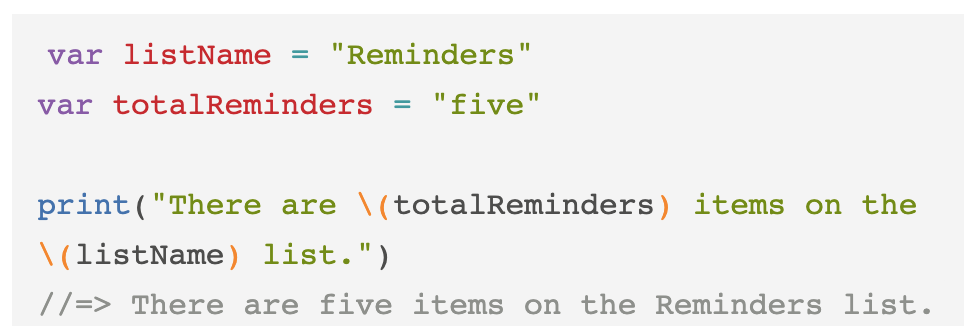

# Notes

This document is where I will be typing my notes as I do the pre-work for this summer's Swift curriculum.

## Technical Vocabulary

The following terms appeared in a lesson as important vocabulary.

* **camelCase**: when a variable is named something that is multiple words, lowercase for the first word and capitalize the first letter of the following word(s)
	* var **lastName** = "Williams"
* **constant**:  defined by *"let"* a constant is a variable that will never change
	* let firstName = "Ashanti"
* **double**:  a number that has a decimal, cannot be combined with an integer/float
* **integer**:  a number without a decimal, cannot be combined with a double (sometimes referred to as a float)
* **interpolation**: including variable information in an output
	* 
* **keyword**: special reserved words in a language  
* **string**: a series of characters between two double quote marks
	* "hello!"
* **variable**: defined by *"var"* followed by the name of the variable and what the variable is
	* var name = "Ashanti"
